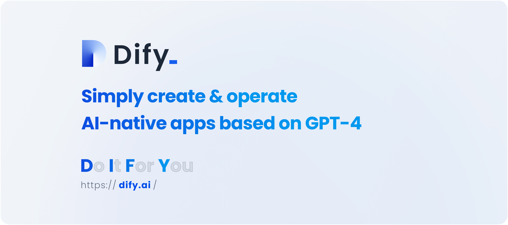

<p align="center">
  <a href="./README.md">English</a> |
  <a href="./README_CN.md">简体中文</a> |
  <a href="./README_JA.md">日本語</a> |
  <a href="./README_ES.md">Español</a>
</p>

[Sitio web](https://dify.ai) • [Documentación](https://docs.dify.ai) • [Twitter](https://twitter.com/dify_ai) • [Discord](https://discord.gg/FngNHpbcY7)

**Dify** es una plataforma LLMOps fácil de usar diseñada para capacitar a más personas para que creen aplicaciones sostenibles basadas en IA. Con orquestación visual para varios tipos de aplicaciones, Dify ofrece aplicaciones listas para usar que también pueden funcionar como APIs de Backend-as-a-Service. Unifica tu proceso de desarrollo con una API para la integración de complementos y conjuntos de datos, y agiliza tus operaciones utilizando una interfaz única para la ingeniería de indicaciones, análisis visual y mejora continua.

Las aplicaciones creadas con Dify incluyen:

- Sitios web listos para usar que admiten el modo de formulario y el modo de conversación por chat.
- Una API única que abarca capacidades de complementos, mejora de contexto y más, lo que te ahorra esfuerzo de programación en el backend.
- Análisis visual de datos, revisión de registros y anotación para aplicaciones.

Dify es compatible con Langchain, lo que significa que gradualmente admitiremos múltiples LLMs, actualmente compatibles con:

- GPT 3 (text-davinci-003)
- GPT 3.5 Turbo (ChatGPT)
- GPT-4

## Usar servicios en la nube

Visita [Dify.ai](https://dify.ai)

## Instalar la Edición Comunitaria

### Requisitos del sistema

Antes de instalar Dify, asegúrate de que tu máquina cumple con los siguientes requisitos mínimos del sistema:

- CPU >= 2 Core
- RAM >= 4GB

### Inicio rápido

La forma más sencilla de iniciar el servidor de Dify es ejecutar nuestro archivo [docker-compose.yml](docker/docker-compose.yaml). Antes de ejecutar el comando de instalación, asegúrate de que [Docker](https://docs.docker.com/get-docker/) y [Docker Compose](https://docs.docker.com/compose/install/) estén instalados en tu máquina:

```bash
cd docker
docker compose up -d
```

Después de ejecutarlo, puedes acceder al panel de control de Dify en tu navegador desde [http://localhost/install](http://localhost/install) y comenzar el proceso de instalación de inicialización.

### Helm Chart

Un gran agradecimiento a @BorisPolonsky por proporcionarnos una versión de [Helm Chart](https://helm.sh/), que permite desplegar Dify en Kubernetes.
Puede ir a https://github.com/BorisPolonsky/dify-helm para obtener información de despliegue.

### Configuración

Si necesitas personalizar la configuración, consulta los comentarios en nuestro archivo [docker-compose.yml](docker/docker-compose.yaml) y configura manualmente la configuración del entorno. Después de realizar los cambios, ejecuta nuevamente 'docker-compose up -d'.

## Hoja de ruta

Funciones en desarrollo:

- **Conjuntos de datos**, admitiendo más conjuntos de datos, por ejemplo, sincronización de contenido desde Notion o páginas web.
Admitiremos más conjuntos de datos, incluidos texto, páginas web e incluso contenido de Notion. Los usuarios pueden construir aplicaciones de IA basadas en sus propias fuentes de datos
- **Complementos**, introduciendo complementos estándar de ChatGPT para aplicaciones, o utilizando complementos producidos por Dify.
Lanzaremos complementos que cumplan con el estándar de ChatGPT, o nuestros propios complementos de Dify para habilitar más capacidades en las aplicaciones.
- **Modelos de código abierto**, por ejemplo, adoptar Llama como proveedor de modelos o para un ajuste adicional.
Trabajaremos con excelentes modelos de código abierto como Llama, proporcionándolos como opciones de modelos en nuestra plataforma o utilizándolos para un ajuste adicional.

## Preguntas y respuestas

**P: ¿Qué puedo hacer con Dify?**

R: Dify es una herramienta de desarrollo y operaciones de LLM, simple pero poderosa. Puedes usarla para construir aplicaciones de calidad comercial y asistentes personales. Si deseas desarrollar tus propias aplicaciones, LangDifyGenius puede ahorrarte trabajo en el backend al integrar con OpenAI y ofrecer capacidades de operaciones visuales, lo que te permite mejorar y entrenar continuamente tu modelo GPT.

**P: ¿Cómo uso Dify para "entrenar" mi propio modelo?**

R: Una aplicación valiosa consta de Ingeniería de indicaciones, mejora de contexto y ajuste fino. Hemos creado un enfoque de programación híbrida que combina las indicaciones con lenguajes de programación (similar a un motor de plantillas), lo que facilita la incorporación de texto largo o la captura de subtítulos de un video de YouTube ingresado por el usuario, todo lo cual se enviará como contexto para que los LLM lo procesen. Damos gran importancia a la operabilidad de la aplicación, con los datos generados por los usuarios durante el uso de la aplicación disponibles para análisis, anotación y entrenamiento continuo. Sin las herramientas adecuadas, estos pasos pueden llevar mucho tiempo.

**P: ¿Qué necesito preparar si quiero crear mi propia aplicación?**

R: Suponemos que ya tienes una clave de API de OpenAI; si no la tienes, por favor regístrate. ¡Si ya tienes contenido que pueda servir como contexto de entrenamiento, eso es genial!

**P: ¿Qué idiomas de interfaz están disponibles?**

R: Actualmente se admiten inglés y chino, y puedes contribuir con paquetes de idiomas.

## Historial de estrellas

[](https://star-history.com/#langgenius/dify&Date)

## Contáctanos

Si tienes alguna pregunta, sugerencia o consulta sobre asociación, no dudes en contactarnos a través de los siguientes canales:

- Presentar un problema o una solicitud de extracción en nuestro repositorio de GitHub.
- Únete a la discusión en nuestra comunidad de [Discord](https://discord.gg/FngNHpbcY7).
- Envía un correo electrónico a hello@dify.ai.

¡Estamos ansiosos por ayudarte y crear juntos aplicaciones de IA más divertidas y útiles!

## Contribuciones

Para garantizar una revisión adecuada, todas las contribuciones de código, incluidas las de los colaboradores con acceso directo a los compromisos, deben enviarse mediante solicitudes de extracción y ser aprobadas por el equipo principal de

 desarrollo antes de fusionarse.

¡Agradecemos todas las solicitudes de extracción! Si deseas ayudar, consulta la [Guía de Contribución](CONTRIBUTING.md) para obtener más información sobre cómo comenzar.

## Seguridad

Para proteger tu privacidad, evita publicar problemas de seguridad en GitHub. En su lugar, envía tus preguntas a security@dify.ai y te proporcionaremos una respuesta más detallada.

## Citación

Este software utiliza el siguiente software de código abierto:

- Chase, H. (2022). LangChain [Software de computadora]. https://github.com/hwchase17/langchain

Para obtener más información, consulta el sitio web oficial o el texto de la licencia del software correspondiente.

## Licencia

Este repositorio está disponible bajo la [Licencia de código abierto de Dify](LICENSE).
